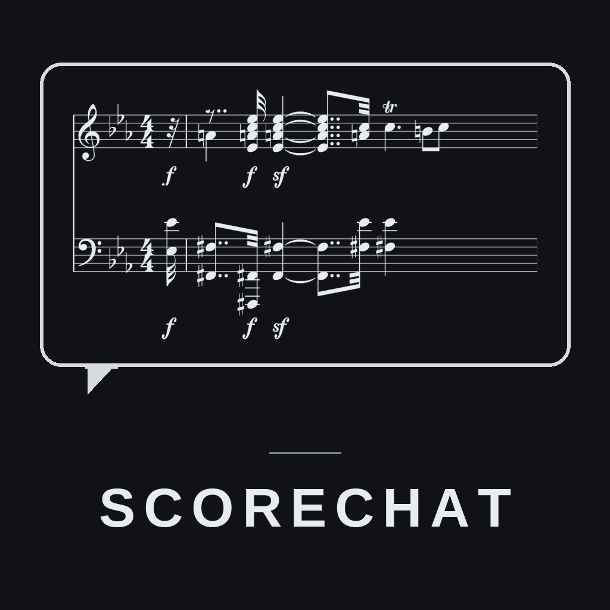
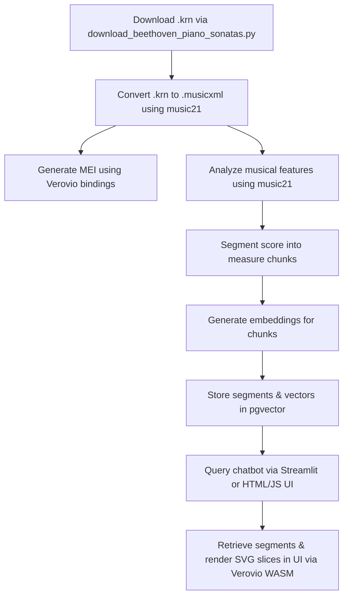

# ScoreChat — Classical Score RAG (Humdrum Edition)



ScoreChat is a Retrieval-Augmented Generation (RAG) system that allows you to chat directly with classical piano scores. By narrowing our scope, we bypass error-prone PDF Optical Music Recognition (OMR) and focus entirely on high-quality symbolic scores in the **Humdrum (`*.krn`)** format.

The system downloads Humdrum scores directly from the [craigsapp/beethoven-piano-sonatas](https://github.com/craigsapp/beethoven-piano-sonatas) repository, converts them to standard MusicXML using `music21`, performs harmonic/texture analysis on measure-level slices, generates embeddings using OpenAI models, and stores them in PostgreSQL with `pgvector`. A web client renders the exact notation slices retrieved during chat sessions dynamically via the **Verovio** WASM toolkit in the browser.

---

## Simplified Pipeline Flow



---

## Features

- **High-Quality Symbolic Ingestion**: Pulls verified Humdrum (`.krn`) files directly from GitHub.
- **Auto-Conversion & Analysis**: Converts `.krn` to MusicXML via `music21` and performs local key, Roman numeral progression, harmonic rhythm, and texture analyses.
- **WASM Notation Rendering**: Generates MEI (`.mei`) files via `verovio` python bindings so that the frontend can dynamically render exact SVG notation slices of the retrieved measures.
- **Hybrid Vector Retrieval**: Combines `pgvector` similarity search on musical analytical summaries with metadata filtering.
- **Double Interface**: Offers both a clean **Streamlit chatbot** and a customized split-screen **HTML/JS frontend** served via a Python HTTP server.

---

## Quickstart

### 1. Set Up Environment
Create a virtual environment and install the required dependencies (requires `uv` for speed):
```bash
uv venv
source .venv/bin/activate
uv pip install -e .
```

### 2. Launch the Vector Database
Launch the local PostgreSQL database preloaded with `pgvector` (requires Docker):
```bash
docker compose up -d
```

### 3. Add API Keys
Copy the example environment file and add your `OPENAI_API_KEY`:
```bash
cp .env.example .env
# Edit .env to add your API key
```

### 4. Ingest Repertoire
Download the Beethoven piano sonata Humdrum files and index them into the database:
```bash
# Download Humdrum files (defaults to Sonata No. 32 / Op. 111)
python download_beethoven_piano_sonatas.py --sonata 32

# Parse, analyze, and ingest the scores into postgres
python ingest_scores.py
```

### 5. Launch the Web Interface
You can run either of the two user interfaces:

* **HTML/JS Client & API Server**:
  ```bash
  python server.py
  ```
  Then open [http://localhost:8000](http://localhost:8000) in your browser.
  
* **Streamlit Chatbot**:
  ```bash
  streamlit run scorechat_app.py
  ```

---

## Project Structure

```
scorechat/
├── data/
│   ├── sonata32-1.krn            # Raw Humdrum score downloaded from GitHub
│   ├── sonata32-1.musicxml       # Auto-generated standard MusicXML
│   └── mei/
│       └── sonata32-1.mei        # Auto-generated MEI for browser SVG rendering
├── db/
│   ├── models.py                 # SQLAlchemy models for Works, Assets, and Segments
│   ├── schema.sql                # SQL schema definitions for pgvector tables
│   └── store.py                  # Database persistence and cleanup functions
├── analysis/
│   └── analyzer.py               # music21-based musical feature extraction and segmentation
├── pipeline/
│   ├── chat.py                   # RAG chat logic and LLM prompt framing
│   ├── retrieval.py              # pgvector cosine similarity score search
│   ├── embedder.py               # OpenAI text embeddings generator
│   └── mei_converter.py          # Verovio-based MusicXML-to-MEI converter
├── frontend/
│   ├── index.html                # Custom HTML/JS chat client and notation viewer
│   └── score_viewer.html         # Standalone score rendering panel
├── download_beethoven_piano_sonatas.py # Downloads .krn files from craigsapp/beethoven-piano-sonatas
├── ingest_scores.py              # Batch converts, analyzes, and indexes data/*.krn to postgres
├── server.py                     # API server and static host for the HTML/JS client
├── scorechat_app.py              # Alternative Streamlit chatbot UI
└── pyproject.toml                # Project packaging and dependencies configuration
```
