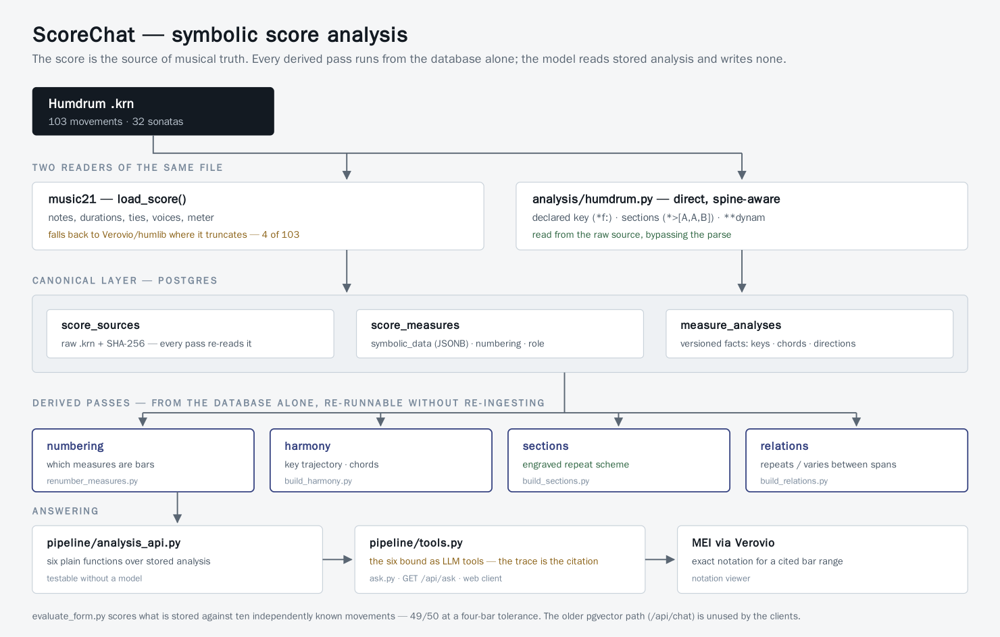

# ScoreChat

Ask questions about Beethoven's piano sonatas and get answers traceable to the score.



The corpus is 32 sonatas — 103 movements — in Humdrum `**kern`, from
[craigsapp/beethoven-piano-sonatas](https://github.com/craigsapp/beethoven-piano-sonatas).
The score is the source of musical truth: the model chooses which stored facts to
fetch and how to phrase them, and invents none of them.

*Diagram source: [`docs/architecture.svg`](docs/architecture.svg) — re-render with
`python -c "import cairosvg; cairosvg.svg2png(url='docs/architecture.svg', write_to='architecture.png', output_width=1480, background_color='#f5f6f7')"`*

## Quickstart

```bash
uv venv && source .venv/bin/activate
uv pip install -e ".[dev]"
docker compose up -d                 # postgres + pgvector
cp .env.example .env                 # add a provider key

python download_beethoven_piano_sonatas.py   # fetch .krn sources
python ingest_scores.py                      # parse, encode, analyse, store
python build_sections.py && python build_relations.py

python ask.py "where is the recapitulation in the Moonlight finale?"
python server.py                     # viewer + API at localhost:8000
```

An existing database needs the migrations in `db/migrations/` applied in order;
`CLAUDE.md` lists them.

## What it answers

Two shapes of question, both served by the same engine:

```bash
python ask.py "describe mm. 195-210 of the Pathetique's first movement in the context of the whole work"
python ask.py "in op 2 no 2 first movement, where does the opening material return?"
```

Each answer prints the tool calls it was built from. **That trace is the
citation** — a claim with no supporting call under it is one to distrust.

## How the model reaches the corpus

Two paths exist, and they are not equivalent.

**Tool calling** (`ask.py`, `GET /api/ask`) is the real one. `pipeline/tools.py`
binds six functions from `pipeline/analysis_api.py` — `resolve_work`,
`describe_span`, `find_recurrences`, `compare_spans`, `get_key_plan`,
`locate_in_form` — which read stored analysis directly. **No embeddings are
involved.**

**Retrieval** (`GET /api/chat`, the Streamlit app, the score viewer's chat box)
is the older path: `pipeline/chat.py` → `pipeline/retrieval.py` → pgvector
cosine search over `score_segments`.

### What is actually vectorised

Only `score_segments.summary_text` — 4,519 prose summaries of measure windows,
embedded to 1536 dimensions. **The score itself is not vectorised.** It is stored
exactly, as JSONB in `score_measures.symbolic_data`, and queried as data.

Neither headline question is a retrieval problem: in "describe mm. x–y" the
measures are *given*, so there is nothing to search for, and "find recurring
material" is an edge in `span_relations` that a vector search over prose cannot
reach. The retrieval path remains because the web client is still written
against it.

## Data model

| table | rows | what it holds |
|---|---|---|
| `works` | 103 | one row per movement |
| `score_sources` | 103 | the raw `.krn` and its checksum; every later pass re-reads the source from here |
| `score_measures` | 18,761 | canonical measure encoding, plus printed numbering and measure role |
| `measure_analyses` | 18,761 | versioned facts: keys, chords, directions, counts, texture |
| `span_analyses` | 9,449 | engraved sections and derived candidate spans |
| `span_relations` | 2,258 | `repeats`/`varies` between spans, with transposition and key evidence |
| `score_segments` | 4,519 | the only embedded table — prose summaries for retrieval |

Derived passes (`renumber_measures.py`, `build_harmony.py`, `build_sections.py`,
`build_relations.py`) run from the database alone, so analysis is re-derivable in
seconds without re-parsing a single file.

## Current state

`python evaluate_form.py` scores the pipeline against ten movements whose form is
known independently: **49/50** at a four-bar tolerance.

Known gaps, in rough order of consequence:

- **Theme-and-variation movements return no relations at all.** Six movements
  have none; the matcher's own pruning bound excludes diminution, so a variation
  with twice the note events is never compared. `diminishes`/`augments` exist as
  relation types with no analyser behind them.
- **Key estimation is sticky.** 22 of 103 movements report a single key region;
  the Moonlight finale misses its G♯ minor second group.
- **Nothing ranks recapitulation candidates** — the one eval failure.
- **Bar numbers follow Durand 1915 (Dukas)**, the edition the encodings
  transcribe. An urtext such as Henle numbers first and second endings from the
  same bar, so numbers diverge in the 36 movements with alternate endings.

## Design notes

`CLAUDE.md` carries the rationale — why each rule is the way it is, and what
broke before it was. Worth reading before changing the analysis.

## Layout

```
analysis/     humdrum.py (read the .krn directly) · numbering.py · harmony.py
              sections.py · span_relations.py · analyzer.py (music21)
pipeline/     analysis_api.py · tools.py · chat.py · retrieval.py
              embedder.py · providers.py · mei_converter.py
db/           models.py · schema.sql · store.py · migrations/
evaluation/   ground_truth.json · scoring.py
frontend/     index.html · score_viewer.html
tests/        155 tests
```
