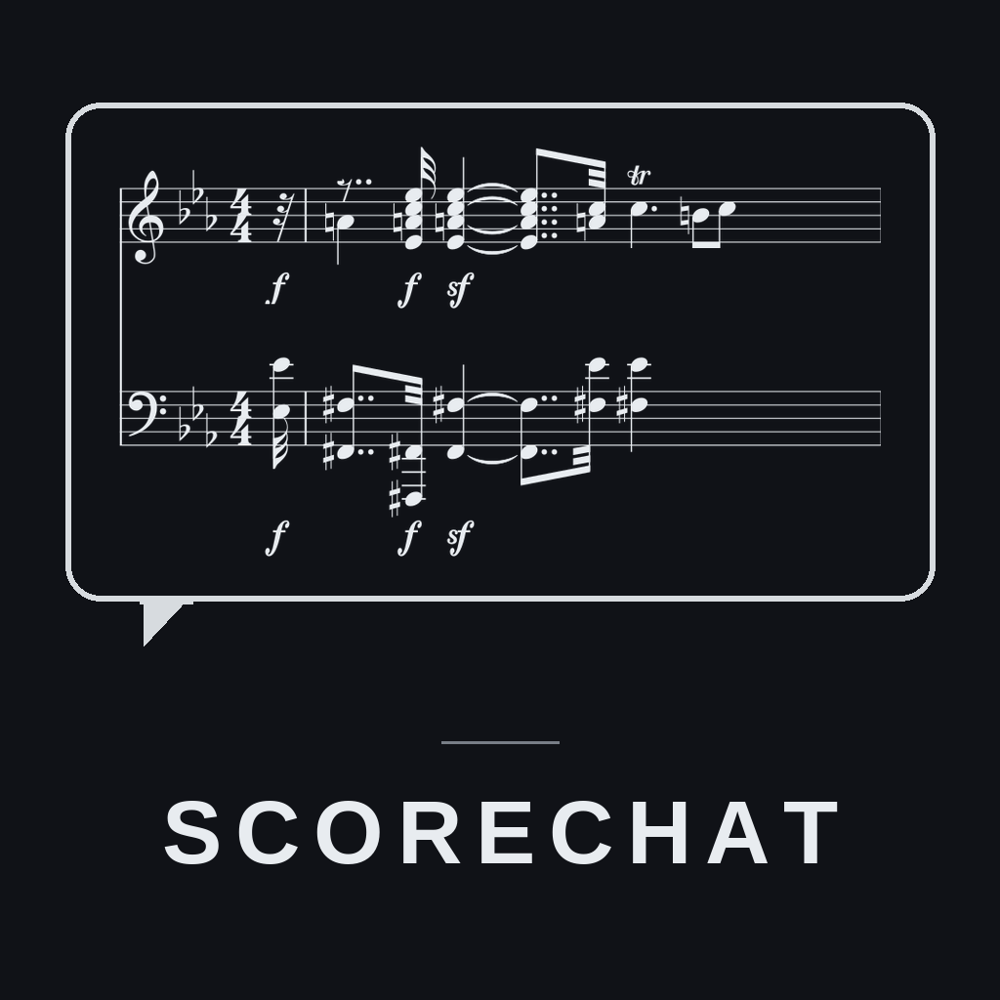
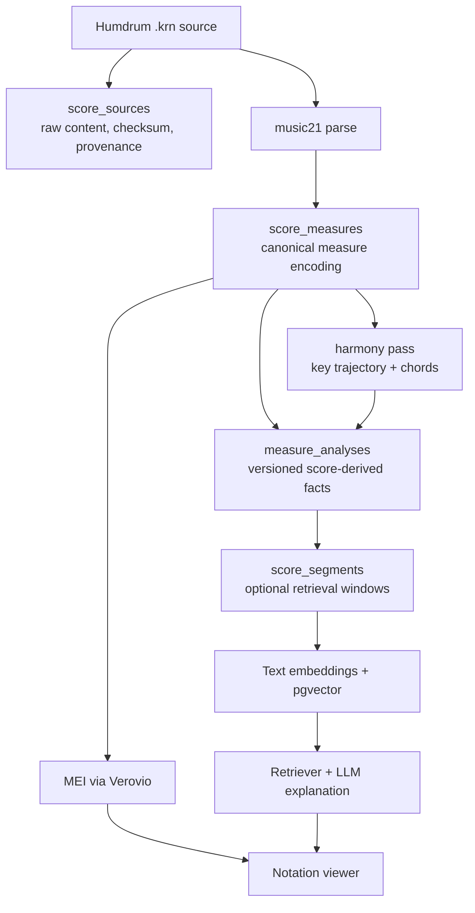

# ScoreChat — Classical Score RAG (Humdrum Edition)



ScoreChat is a symbolic-score analysis and retrieval system for classical piano music in **Humdrum (`*.krn`)** format. It preserves the source notation, derives reproducible musical facts from it, and uses retrieval and an LLM only to help locate and explain evidence-backed score passages.

The system downloads Humdrum scores directly from the [craigsapp/beethoven-piano-sonatas](https://github.com/craigsapp/beethoven-piano-sonatas) repository, preserves their raw symbolic source and checksum, encodes each notated measure through `music21`, and stores versioned measure-level analysis alongside optional retrieval embeddings in PostgreSQL with `pgvector`. A web client renders retrieved notation slices dynamically via the **Verovio** WASM toolkit in the browser.

---

## Architecture


```mermaid
graph TD
    A[Humdrum .krn source] --> B[score_sources
raw content, checksum, provenance]
    A --> C[music21 parse]
    C --> D[score_measures
canonical measure encoding]
    D --> E[measure_analyses
versioned score-derived facts]
    D --> K[harmony pass
key trajectory + chords]
    K --> E
    E --> F[score_segments
optional retrieval windows]
    F --> G[Text embeddings + pgvector]
    D --> H[MEI via Verovio]
    G --> I[Retriever + LLM explanation]
    H --> J[Notation viewer]
    I --> J
```

The raw score and deterministic symbolic layers are the source of musical
evidence. Retrieval narrows passages for a question; it does not replace the
underlying notation or create analytical facts.

---

## Features

- **High-Quality Symbolic Ingestion**: Pulls verified Humdrum (`.krn`) files directly from GitHub.
- **Score-Derived Analysis**: Uses `music21` to create canonical measure encodings and versioned rhythm and texture candidates.
- **Harmonic Analysis**: Key trajectory and Roman-numeral chord labels derived from the canonical layer, anchored to notated evidence (staff key signature, closing bass) rather than statistical inference alone. Passages that determine no chord are left unlabelled instead of guessed.
- **WASM Notation Rendering**: Generates MEI (`.mei`) files via `verovio` python bindings so that the frontend can dynamically render exact SVG notation slices of the retrieved measures.
- **Hybrid Vector Retrieval**: Combines `pgvector` similarity search on musical analytical summaries with metadata filtering.
- **Double Interface**: Offers both a clean **Streamlit chatbot** and a customized split-screen **HTML/JS frontend** served via a Python HTTP server.

## Symbolic Score Data Model

ScoreChat keeps symbolic notation as its analytical source of truth. Embeddings
are optional retrieval aids; they do not replace score data or determine the
musical analysis.

- `score_sources` retains the exact Humdrum content, SHA-256 checksum, local
  path, and upstream source URL. This is the authoritative source for details
  not represented by a parser.
- `score_measures` stores a JSON-safe encoding of each measure across all
  parts: note/chord/rest events, pitch spellings and MIDI values, offsets,
  durations, ties, articulations, expressions, signatures, directions, and
  barlines.
- `measure_analyses` stores versioned, reproducible calculations from those
  measures: pitch classes, rhythm values, note/rest/chord counts, directions,
  `local_key` with its correlation, and `chords` — beat-aligned spans carrying
  a Roman-numeral `figure`, root, quality, bass, confidence, and the pitch
  classes the chord does not explain (non-chord tones). Texture candidates use
  the primary part and identify that scope in the stored analysis; the key
  estimate is whole-texture and windowed.
- `analysis_runs` records the analyser, version, configuration, and source
  checksum for each broader analysis pass.
- `span_analyses` stores variable-length, evidence-backed candidates and later
  phrase/theme/variation/transition claims. The initial analyser only creates
  `candidate` spans at meter changes, notated directions, and structural
  barlines; it does not infer formal labels.
- `span_relations` records relations between spans, such as repetition,
  variation, inversion, diminution, augmentation, or meter change.
  `build_relations.py` proposes `repeats` and `varies` relations by comparing
  ordered pitch-class and rhythm sequences between every same-length window of
  a movement; the remaining relation types have no analyser yet. Each relation
  carries its comparison evidence and, separately, whether the material returns
  in the key it was stated in — the signal that distinguishes a recapitulation
  from a transposed restatement.

## Evaluation

`evaluate_form.py` scores the pipeline against `evaluation/ground_truth.json`,
ten movements whose form is known independently. It reads only the database, so
it scores what the pipeline has actually stored, and re-running it after a
threshold change says whether the change helped or merely moved the failures.

```bash
python evaluate_form.py --verbose
```

The ground truth records two different bars for the return of the opening
material, and the distinction is the point. `recapitulation` is where published
analysis puts the start of the recapitulation; `literal_return` is where
note-for-note correspondence with the exposition actually resumes. They coincide
when Beethoven brings the theme back unaltered (Op. 2 No. 1/i, m. 101) and
diverge when he recomposes its first bars — the Waldstein's recapitulation is at
m. 156 but correspondence with m. 3 does not resume until m. 160. A symbolic
matcher can only ever find the second, so that is what it is scored against,
with the published bar recorded alongside so the gap stays visible.

Three entries record no literal return at all. Those are real negatives the
pipeline must also return nothing for, which is what stops the metrics from
being improved by lowering a threshold. `return_recall` (was the return
proposed at all) is scored apart from `return` (was it ranked first), because
locating a passage and ranking it are different jobs and nothing yet does the
second.

Current result, at a tolerance of four bars: **49/50** — `home_key`,
`exposition_start`, `return_recall` and `citable` all 10/10, `return` 9/10.
The single failure is a ranking problem rather than an analysis one: the
Pathétique's return at m. 197 is proposed, but a coda return at m. 301 outranks
it, and nothing yet does the ranking.

Span analyses and relations have a review lifecycle: `proposed`, `accepted`,
or `rejected`. The current pipeline creates only `proposed` analytical claims;
the user interface does not yet expose review controls. A future UI should let
users inspect each claim's score evidence and explicitly accept or reject it
without changing the underlying source notation.

## Harmonic Analysis

`analysis/harmony.py` runs as a second pass over the finished canonical layer.
It is a pure function of stored `score_measures.symbolic_data`, so a harmonic
pass is reproducible from the database alone and can be re-run and re-versioned
without re-parsing the source `.krn`.

**Measure numbering.** Two schemes coexist. `measure_number` is printed
numbering — bar 1 is the first complete measure, an anacrusis is uncounted and
stored as `0` — and is what the interface displays, what a user types, and what
the LLM cites. `measure_index` is the internal 0-based position, including
unnumbered measures, and is what span analysis and relation matching key on.
Verovio's MEI uses printed numbering too, but its measure *selection* counts
ordinal positions in which a pickup counts as one, so rendering a cited range
translates between the two rather than passing numbers through.

**Score loading.** `.krn` files are parsed through `load_score()`, which
validates the result against the numbered barlines in the source. music21's
Humdrum reader silently drops music at nested spine splits — four movements in
this corpus lost between 10 and 150 measures, one of them 93% of the piece —
so a short parse falls back to Verovio's importer via MEI. Key and meter are
read directly from the Humdrum text rather than from whichever importer ran,
since they are notated facts in the source and are load-bearing for key
estimation. Ingestion refuses to store a score that still parses short.

**Key trajectory.** Duration-weighted pitch-class profiles are correlated
against Krumhansl-Kessler key profiles over a sliding window, then smoothed by
a Viterbi pass so a modulation must outweigh a change penalty rather than
following every passing tonicisation. Profile correlation alone is biased
toward the *dominant* of the true key, because a cantabile melody dwells on the
fifth — unaided, it reads the Pathétique Adagio as E♭ major. Two pieces of
notated evidence correct this: the staff key signature, which admits exactly
two keys, and the bass of the final sounding measure, which separates a key
from its relative. Both are engraved in the source, not inferred.

**Chords.** Beat-sized windows aggregate sounding duration — a note is
apportioned to every beat it overlaps, so a held bass supports the harmony for
its full length — and each window is fitted against triad and seventh-chord
templates. Pitches the winning template does not explain are reported as
non-chord tones. Adjacent windows agreeing on a chord are merged, so output
tracks harmonic rhythm rather than note onsets. A window too thin to determine
a triad borrows pitch content from the narrowest surrounding context that can,
which is what lets an arpeggiated measure read as the single chord it outlines.
Roman numerals are computed arithmetically from scale degree, quality, and
inversion, sidestepping enharmonic spelling entirely.

**Confidence and abstention.** Roughly 82% of chord spans across the corpus
carry a figure. The remainder are scalar, chromatic, or otherwise
under-determined passages where no single chord is defensible, and these are
deliberately left unlabelled — an honest gap is preferable to a confident
fabrication reaching the LLM as evidence. Reported `correlation` and
`confidence` values exclude the signature, home-key, and bass weightings used
to *select* an answer, so a stored confidence reflects the score evidence
alone.

Tuning constants are pinned by ground-truth tests in `tests/test_harmony.py`
against published analyses of specific movements, not against the
implementation's own output.

---

## Notated Structure

Humdrum scores label their sections and state the order they are played in
(`*>[A,A,B]` — play A twice, then B). This is engraved structure rather than
inference, and it records exactly which stretch of music was marked to repeat.
`music21` discards these records, so ScoreChat reads them from the preserved
raw source and stores them as spans.

A repeat covering much of a movement is the clearest single indicator of sonata
form — 62% of first movements in this corpus have one spanning at least a third
of the movement, against 16% of second movements and none of the fourth — and
*which* section repeats characterises the movement. Both halves repeated is the
Classical norm (Op. 2 No. 1/i). A repeated second section with an unrepeated
first is Beethoven inverting it: Op. 57's finale plays its exposition once and
repeats its development and recapitulation. A short unrepeated section before a
repeated one is usually a slow introduction standing outside the form
(Op. 111/i). No expansion record at all means no repeat was notated, as in
Op. 57's first movement.

The parser records the scheme; it does not name any section an exposition or a
development.

## Finding Recurring Material

The relations pass slides each reference span across its movement and scores
every same-length window, so a thematic return is found without pre-identified
section boundaries or repeat signs. On Beethoven's Op. 2 No. 1/i it relates the
opening material at mm. 2–11 to a return at mm. 102–111 in the tonic; the
movement's recapitulation begins at m. 101. On the Hammerklavier it reports
several correspondences sharing a 238-measure offset — the exposition mapped
onto the recapitulation — derived entirely from symbolic comparison, with no
model of sonata form anywhere in the system.

Each relation also records the interval separating the two passages. Because
variation matching compares interval sequences, it recognises transposed
material without knowing the transposition — yet that offset is precisely what
distinguishes a theme restated at pitch from a second group brought home from
another key. On Op. 27 No. 2/iii the pass reports the main theme returning at
mm. 103–118 *at pitch*, while second-group material from mm. 39–48 returns at
mm. 134–143 transposed up a perfect fourth with every note accounted for — the
textbook shape of a minor-key sonata recapitulation, recovered from the notes.

Relations remain proposals. Nothing in the pass asserts that a span *is* a
theme or a recapitulation; it records that two ranges correspond, how strongly,
in what key, and at what transposition.

Form, theme, variation, and motif relationships are intentionally not asserted
in these first layers. They should be added later as evidence-backed analyses
of the preserved score data, rather than as ungrounded metadata or embedding
output.

---

## Quickstart

### 1. Set Up Environment
Create a virtual environment and install the required dependencies (requires `uv` for speed):
```bash
uv venv
source .venv/bin/activate
uv pip install -e .
```

### 2. Launch the Vector Database
Launch the local PostgreSQL database preloaded with `pgvector` (requires Docker):
```bash
docker compose up -d
```

If the database was created before the symbolic layers were added, apply the
one-time migration before ingesting again:

```bash
psql "$DATABASE_URL" -f db/migrations/001_symbolic_layers.sql
psql "$DATABASE_URL" -f db/migrations/002_span_analysis.sql
```

To rebuild only the symbolic source, measure encodings, and measure analyses
without regenerating MEI files or embeddings, use:

```bash
python ingest_scores.py --symbolic-only
```

### 3. Add API Keys
Copy the example environment file and add your `OPENAI_API_KEY`:
```bash
cp .env.example .env
# Edit .env to add your API key
```

### 4. Ingest Repertoire
Download the Beethoven piano sonata Humdrum files and index them into the database:
```bash
# Download Humdrum files (defaults to Sonata No. 32 / Op. 111)
python download_beethoven_piano_sonatas.py --sonata 32

# Parse, analyze, and ingest the scores into postgres
python ingest_scores.py
```

### 5. Launch the Web Interface
You can run either of the two user interfaces:

* **HTML/JS Client & API Server**:
  ```bash
  python server.py
  ```
  Then open [http://localhost:8000](http://localhost:8000) in your browser.
  
* **Streamlit Chatbot**:
  ```bash
  streamlit run scorechat_app.py
  ```

---

## Project Structure

```
scorechat/
├── data/
│   ├── sonata32-1.krn            # Raw Humdrum score downloaded from GitHub
│   ├── sonata32-1.musicxml       # Auto-generated standard MusicXML
│   └── mei/
│       └── sonata32-1.mei        # Auto-generated MEI for browser SVG rendering
├── db/
│   ├── models.py                 # SQLAlchemy models for Works, Assets, and Segments
│   ├── schema.sql                # SQL schema definitions for pgvector tables
│   └── store.py                  # Database persistence and cleanup functions
├── analysis/
│   └── analyzer.py               # music21-based musical feature extraction and segmentation
├── pipeline/
│   ├── chat.py                   # RAG chat logic and LLM prompt framing
│   ├── retrieval.py              # pgvector cosine similarity score search
│   ├── embedder.py               # OpenAI text embeddings generator
│   └── mei_converter.py          # Verovio-based MusicXML-to-MEI converter
├── frontend/
│   ├── index.html                # Custom HTML/JS chat client and notation viewer
│   └── score_viewer.html         # Standalone score rendering panel
├── download_beethoven_piano_sonatas.py # Downloads .krn files from craigsapp/beethoven-piano-sonatas
├── ingest_scores.py              # Batch converts, analyzes, and indexes data/*.krn to postgres
├── server.py                     # API server and static host for the HTML/JS client
├── scorechat_app.py              # Alternative Streamlit chatbot UI
└── pyproject.toml                # Project packaging and dependencies configuration
```
